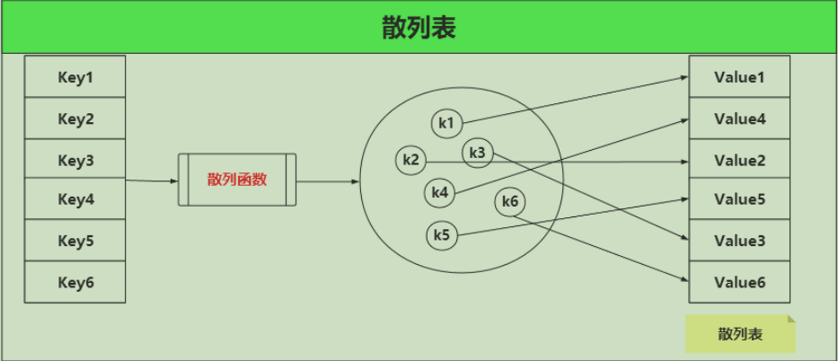

# jdk11 源码
##  java.base


### java.io：


### java.lang：

#### Object 

没有被native修饰的方法： equals(Object obj)  finalize()  toString()

1. equals()

   - 在Java规范中，对 equals ⽅法的使⽤必须遵循以下⼏个原则：

     1. ⾃反性：对于任何⾮空引⽤值 x，x.equals(x) 都应返回 true。
     2. 对称性：对于任何⾮空引⽤值 x 和 y，当且仅当 y.equals(x) 返回 true 时，x.equals(y) 才应返回 true。
     3. 传递性：对于任何⾮空引⽤值 x、y 和 z，如果 x.equals(y) 返回 true，并且 y.equals(z) 返回true，那么 x.equals(z) 应返回 true。
     4. ⼀致性：对于任何⾮空引⽤值 x 和 y，多次调⽤ x.equals(y) 始终返回 true 或始终返回 false，前提是对象上 equals ⽐较中所⽤的信息没有被修改。
     5. 对于任何⾮空引⽤值 x，x.equals(null) 都应返回 false。

   - 所以什么时候使⽤ instanceof 运算符，什么时候使⽤ getClass() 有如下建议：

     1. 如果⼦类能够拥有⾃⼰的相等概念，则对称性需求将强制采⽤ getClass 进⾏检测。

     2. 如果有超类决定相等的概念，那么就可以使⽤ instanceof 进⾏检测，这样可以在不同的⼦类的对象之间进⾏相等的⽐较。

   - Person 类中完整的 equals ⽅法的书写：

     请注意，⽆论何时重写此⽅法，通常都必须重写hashCode()，以维护hashCode()的⼀般约定，该⽅法声明相等对象必须具有相同的哈希代码。

     ```java
     @Override
     public boolean equals(Object otherObject) {
          // 1、判断⽐较的两个对象引⽤是否相等，如果引⽤相等那么表示是同⼀个对象，那么当然相等
          if(this == otherObject) {
         	 return true;
          }
          // 2、如果 otherObject 为 null，直接返回false，表示不相等
          if(otherObject == null ) { // 对象为空或者不是Person类的实例
          	return false;
          }
          // 3、⽐较 this 和 otherObject 是否是同⼀个类（注意下⾯两个只能使⽤⼀种）
          // 3.1：如果 equals 的语义在每个⼦类中所有改变，就使⽤ getClass 检测
          if(this.getClass() != otherObject.getClass()) {
          	return false;
          }
          // 3.2：如果所有的⼦类都有统⼀的定义，那么使⽤ instanceof 检测
          if(!(otherObject instanceof Person)) {
          	return false;
          }
          
          // 4、将 otherObject 转换成对应的类类型变量
     	 Person other = (Person) otherObject;
          
          // 5、最后对对象的属性进⾏⽐较。使⽤ == ⽐较基本类型，使⽤ equals ⽐较对象。如果都相等则返回true，否则返回false
     	 // 使⽤ Objects ⼯具类的 equals ⽅法防⽌⽐较的两个对象有⼀个为 null⽽报错，因为 null.equals() 是会抛异常的
          return Objects.equals(this.pname,other.pname) && this.page == other.page;
      	 // 6、注意如果是在⼦类中定义equals，则要包含 super.equals(other)
      	 // return super.equals(other) &&
     	 Objects.equals(this.pname,other.pname) && this.page == other.page;
      }
     ```

     

2. getClass()：class是⼀个类的属性，能获取该类编译时的类对象，⽽ getClass()是⼀个类的⽅法，它是获取该类运⾏时的类对象。

   　还有⼀个需要⼤家注意的是，虽然Object类中getClass() ⽅法声明是：`public final native Class getClass();`返回的是⼀个 Class，

   ​	但是如下是能通过编译的：`Class<? extends String> c = "".getClass();`

   ​	也就是说类型为T的变量 getClass() 的返回值类型其实是Class⽽⾮getClass⽅法声明中的Class。

3. hashCode()

4. 

#### Integer

1. **Integer** **的声明**
2. **主要属性**：
   1. value:int
   2. MIN_VALUE、MAX_VALUE、SIZE
3. **构造方法**：已过期
4. **toString() toString(int i) toString(int i, int radix)**
5. **自动拆箱和装箱**
- Integet.valueOf(int i)：
  - 若`i`满足`IntegerCache.low && IntegerCache.high`，则从`IntegerCache.cache`中取出。
  - 否则，`new Integer(i)`。
- intValue()：直接返回 `value` 。
  
6. **equals(Object obj)**：

   ```java
   public boolean equals(Object obj) {
       if (obj instanceof Integer) {
       return value == ((Integer)obj).intValue();
       }
       return false;
   }
   ```

7. **hashCode()** ：调用静态方法`hashCode(int value)`，直接返回 `value`。

8. **parseInt(String s)** **和** **parseInt(String s, int radix)** 

   - radix：表示几进制，默认传“10”，十进制。

   过程：

   1. 基本校验：s是否为空；radix < 2 || radix > 36 ；

   2. 判断 s.charAt(0) 为正为负数

   3. 若0位置有正负号，则i从1开始，若无，i则中0位置开始。

   4. while (i < len) { } 通过不断循环，根据进制不断相乘在相加得到⼀个正整数。

      eg：parseInt("2abc",16) = 2 \*16的 3次⽅ + 10 \* 16的2次⽅ + 11 \* 16 + 12 \* 1

      ​		parseInt("123",10) = 1 \* 10的2次⽅ + 2 \* 10 + 3 \* 1

9. **compareTo(Integer anotherInteger) 和 compare(int x, int y)**

   `compareTo(Integer anotherInteger)` 调用 `compare(int x, int y)`，默认升序。

   ```java
   public static int compare(int x, int y) {
      return (x < y) ? -1 : ((x == y) ? 0 : 1);
   }
   ```

   

#### String

1. **String 类的定义**

2. **字段属性**

   `value[]`：⽤来存储字符串:

   - JDK8：private final char value[];

   - JDK11：private final byte[] value;

3. **构造⽅法**

4. **equals(Object anObject)**：⽐较的是组成字符串的每⼀个字符是否相同，如果都相同则返回true，否则返回false。

5. **hashCode()**：

   String 类的 hashCode 算法很简单，主要就是中间的 for 循环，计算公式如下：s[0]31^(n-1) + s[1]31^(n-2) + ... + s[n-1]

   s 数组即源码中的 val 数组，也就是构成字符串的字符数组。这⾥有个数字 31 ，为什么选择31作为乘积因⼦，⽽且没有⽤⼀个常量来声明？

   主要原因有两个：

   * 31是⼀个不⼤不⼩的质数，是作为 hashCode 乘⼦的优选质数之⼀。
   * 31可以被 JVM 优化，31 * i = (i << 5) - i。因为移位运算⽐乘法运⾏更快更省性能。

6. **charAt(int index)**：

   - JDK8，字符串由字符数组组成，这个⽅法是通过传⼊的索引（数组下标），返回指定索引的单个字符。
   - JDK11，字符串有字节数组组成

7. **compareTo(String anotherString) 和 compareToIgnoreCase(String str)**：

   - compareTo(String anotherString) ：

     按字⺟顺序⽐较两个字符串，是基于字符串中每个字符的 Unicode 值。

     当两个字符串某个位置的字符不同时，返回的是这⼀位置的字符 Unicode 值之差，当两个字符串都相同时，返回两个字符串⻓度之差。

   - compareToIgnoreCase(String str)：

     compareToIgnoreCase() ⽅法在 compareTo ⽅法的基础上忽略⼤⼩写，我们知道⼤写字⺟是⽐⼩写字⺟的Unicode值⼩32的，底层实现是先都转换成⼤写⽐较，然后都转换成⼩写进⾏⽐较。

8. **concat(String str)**： 

9. **indexOf(int ch) 和 indexOf(int ch, int fromIndex)**

10. **split(String regex) 和 split(String regex, int limit)**

11. **replace(char oldChar, char newChar) 和 String replaceAll(String regex, String replacement)**

12. **substring(int beginIndex)  和 substring(int beginIndex, int endIndex)**

13. **常量池**

14. **intern()** 

15. **String** **真的不可变吗**


### java.util：

#### Arrays

1. 4个内部类：
   1. `ArrayItr` <E> implements Iterator<E>
   2. `ArrayList` extends AbstractList<E> implements RandomAccess, java.io.Serializable
   3. LegacyMergeSort
   4. NaturalOrder
2. **asList**
3. **sort**
4. **binarySearch**
5. **copyOf**
6. **equals 和 deepEquals**
7. **fill**
8. **toString** **和** **deepToString**


#### ArrayList

1. 4个内部类：

   1. ArrayListSpliterator

   2. **Itr** implements Iterator<E> 

   3. **ListItr** extends **Itr** implements ListIterator<E>

   4. SubList extends AbstractList<E> implements RandomAccess ：

      返回的是原集合的视图，也就是说，如果对 subList 出来的集合进⾏修改或新增操作，那么原始集合也会发⽣同样的操作。

2. **ArrayList 定义**

3. **字段属性**

4. **构造函数**

5. **添加元素**
   - add()
   - offer

6. **删除元素**
   - remove(int index)
   - remove(E e)

7. **修改元素**

   - set(int index, E element) 

8. **查找元素**

   - get(int index)

9. **遍历集合**
   - **普通** **for** **循环遍历**
   - **迭代器** **iterator**
   - **迭代器的变种** **forEach** 即加强for循环
   - **迭代器** **ListIterator**

10. **SubList**

11. **size()**：返回集合的⻓度，⽽不是数组的⻓度，这⾥的 size 就是定义的全局变量。

12. **isEmpty()**

13. **trimToSize()**：该⽅法⽤于回收多余的内存。也就是说⼀旦我们确定集合不在添加多余的元素之后，调⽤trimToSize() ⽅法会将实现集合的数组⼤⼩刚好调整为集合元素的⼤⼩。


#### LinkedList

1. 4个内部类：
   1. DescendingIterator implements Iterator<E> 通过适配器模式实现的接⼝，作⽤是倒叙打印链表
   2. ListItr implements ListIterator<E>
   3. LLSpliterator
   4. Node<E>
2. **LinkedList** **定义**
3. **字段属性**
4. **构造函数**
5. **添加元素**
   - add()
   - offer
6. **删除元素**
   - remove(int index)
   - remove(E e)
7. **修改元素**
   - set(int index, E element) 
8. **查找元素**
   - get(int index)
9. **遍历集合**
   - **普通** **for** **循环**
   - **迭代器**
10. **迭代器和for循环效率差异**


#### HashMap

1. 13个内部类

   1. EntryIterator extends HashIterator implements Iterator<Map.Entry<K, V>>
   2. EntrySet extends AbstractSet<Map.Entry<K, V>>
   3. EntrySpliterator<K, V>
   4. HashMapSpliterator
   5. KeyIterator extends HashIterator implements Iterator<K>
   6. KeySet
   7. KeySpliterator<K, V>
   8. Node<K, V> implements Map.Entry<K, V>
   9. TreeNode<K, V> extends LinkedHashMap.Entry<K, V>
   10. ValueIterator extends HashIterator implements Iterator<V>
   11. Values
   12. ValueSpliterator<K, V>

2. **哈希表**

   想查找是否存在键值对 Key3-Value3，⾸先通过 Key3 经过**散列函数**，得到值 k3，然后通过 k3 和**散列表**对应的值找到是 Value3。

   

   - 为什么要有散列函数？

     散列函数的存在能够帮助我们更快的确定key和value的映射关系，试想⼀下，如果没有汉字和拼⾳的转换规则（或者汉字和偏旁部⾸的），给你⼀个汉字，你该如何从字典中找到该汉字？我想除了遍历整部字典，你没有什么更好的办法。

   - 多个 key 通过散列函数会得到相同的值，这时候怎么办？

     多个 key 通过散列函数得到相同的值，这其实也是哈希表最⼤的问题——冲突。

     - 开放地址法
     - 链地址法：我们可以将字典的每⼀⻚都看成是⼀个⼦数组或者⼦链表，当遇到冲突了，直接往当前⻚码的⼦数组或者⼦链表⾥⾯填充即可。那么我们进⾏同⾳字查找的时候，可能需要遍历其⼦数组或者⼦链表。

3. **HashMap 定义**

4. **字段属性**

5. **构造函数**

6. **确定哈希桶数组索引位置**

7. **添加元素**
   - put(K key, V value) 
   - 

8. **扩容机制**

   - resize(int newCapacity)

9. **删除元素**

10. **查找元素**

11. **遍历元素**

12. **总结**

    1. 基于JDK1.8的HashMap是由数组+链表+红⿊树组成，当链表⻓度超过 8 时会⾃动转换成红⿊树，当红⿊树节点个数⼩于 6 时，⼜会转化成链表。相对于早期版本的 JDK HashMap 实现，新增了红⿊树作为底层数据结构，在数据量较⼤且哈希碰撞较多时，能够极⼤的增加检索的效率。
    2. 允许 key 和 value 都为 null。key 重复会被覆盖，value 允许重复。
    3. ⾮线程安全
    4. ⽆序（遍历HashMap得到元素的顺序不是按照插⼊的顺序）


#### HashSet

1. **HashSet** **定义**
2. **字段属性**
3. **构造函数**
4. **添加元素**
5. **删除元素**
6. **查找元素**
7. **遍历元素**


#### LinkedHashMap

1. **LinkedHashMap 定义**

   LinkedHashMap = HashMap + LinkedList。LinkedHashMap 就是在 HashMap 的基础上多维护了⼀个双向链表，⽤来保证元素迭代顺序。

2. **字段属性**

3. **构造函数**

4. **添加元素**

5. **删除元素**

6. **查找元素**

7. **遍历元素**

8. **迭代器**


#### LinkedHashSet

1. **LinkedHashSet 定义**
2. **构造函数**
3. **添加元素**
4. **删除元素**
5. **查找元素**
6. **遍历元素**


### JUC(Java.util.concurrent)

#### 并发容器

##### 1. BlockingQueue

######  1.1 ArrayBlockingQueue

ArrayBlockingQueue是一个用数组实现的环形队列，在构造方法中，会要求传入数组的容量。


###### 1.2  LinkedBlockingQueue


###### 1.3 PriorityBlockingQueue


###### 1.4 DelayQueue


###### 1.5 SynchronousQueue


##### 2.  BlockingDeque


##### 3.  CopyOnWrite

###### 3.1 CopyOnWriteArrayList


###### 3.2 CopyOnWriteArraySet


##### 4. ConcurrentLinkedQueue/Deque

###### 4.1 ConcurrentLinkedQueue 

###### 4.2 ConcurrentLinkedDeque


##### 5. ConcurrentHashMap


##### 6. ConcurrentSkipListMap/Set

###### 6.1  ConcurrentSkipListMap


###### 6.2 ConcurrentSkipListSet


#### 同步工具类

##### 1. Semaphore


#####  2. CountDownLatch


##### 3. CyclicBarrier


##### 4. Exchanger


##### 5. Phaser


#### Atomic 类

##### 1.  AtomicInteger 和 AtomicLong


##### 2. AtomicBoolean 和 AtomicReference


##### 3. AtomicStampedReference 和 AtomicMarkableReference


##### 4.  AtomicIntegerFieldUpdater、AtomicLongFieldUpdater 和 AtomicReferenceFieldUpdater


##### 5.  AtomicIntegerArray、AtomicLongArray 和 AtomicReferenceArray


##### 6. Striped64 与 LongAdder


#### Lock 与 Condition

##### 1. 互斥锁 ReentrantLock 


##### 2. 读写锁 ReentrantReadWriteLock


##### 3. Condition


##### 4. StampedLock